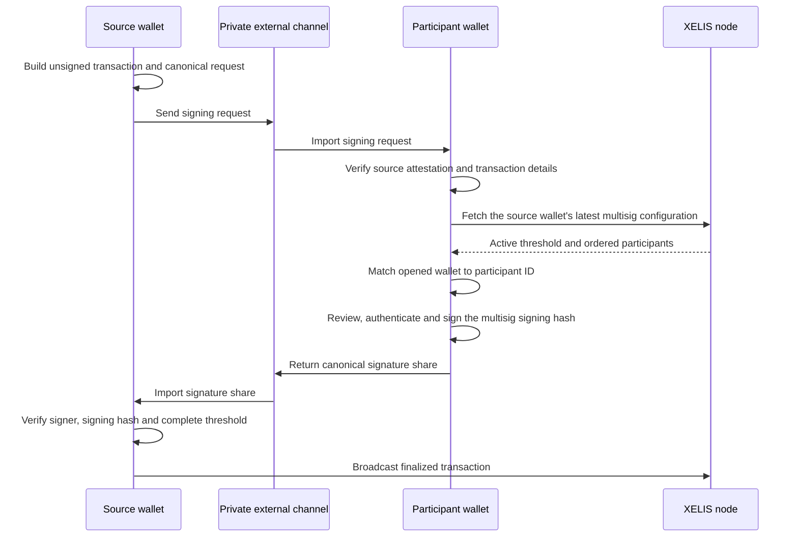

# Multisig signing protocol

This guide is for Flutter applications exchanging canonical multisig signing
requests and signature shares. The transport is deliberately outside the
protocol: copy and paste, files, deep links, or QR codes can all use the same
native validation rules.

## Protocol v1

The request envelope contains a versioned payload and a source signature. The
source signature is computed over these exact bytes:

```text
"xelis:wallet:multisig-signing-request:v1\0" + canonical_payload_json
```

The domain is part of the cryptographic protocol. The trailing zero byte is an
explicit separator and must not be removed.

The payload contains:

- `version`;
- `network`;
- the canonical unsigned transaction bytes;
- the public transaction details and, for confidential transfers, amount
  proofs that bind the displayed amounts to the transaction ciphertexts.

The source attestation protects the complete payload. It is distinct from a
participant signature.

After validating and reconstructing the request, a participant signs
`UnsignedTransaction::get_hash_for_multisig()`. The public API calls this value
the **multisig signing hash**. A signature-share envelope contains:

```json
{
  "version": 1,
  "signing_hash": "...",
  "signer_id": 0,
  "signature": "..."
}
```

The signing hash is not a hash of the request JSON and is not the final
transaction identifier. The finalized transaction receives its own hash after
the multisig signatures and the source signature have been attached.

The supported Dart surface uses only authored
`XelisWalletMultisigSigningRequest`, `XelisWalletMultisigSignatureShare`,
`XelisWalletMultisigState`, and typed transaction-preview classes. Fees,
amounts, nonces, and topoheights remain exact `BigInt` values. Generated FRB
DTOs and JSON summaries are private bridge details.

The request-envelope version and signature-share version are independent.
After v1 is published, any incompatible change to signed bytes, canonical JSON,
field meaning, or serialized field names requires a new protocol version.

## End-to-end flow



The node does not transport requests or signature shares. Applications must
send both values through an external channel.

## Why participant verification needs a node

`xelis_wallet` stores the multisig state of the opened wallet's own address. A
participant wallet does not locally contain the multisig configuration of the
source address merely because it is one of that address's participants.

The canonical request deliberately does not claim an authoritative participant
configuration. The native runtime asks the connected node for the source
address's latest active configuration so it can:

- reject a deleted or invalid configuration;
- expose the active threshold and ordered participants;
- determine the opened wallet's participant ID;
- refuse to sign when the opened wallet is not a participant.

This lookup is an additional safety check. It reflects the configuration at
inspection or signing time; consensus remains authoritative when the finalized
transaction is broadcast. The Rust API fails closed when no node connection is
available.

## Security properties

Before returning a verified request, the native runtime:

- enforces the expected network, size limits, version and canonical encoding;
- reconstructs the unsigned transaction and its multisig signing hash;
- verifies the source wallet's domain-separated attestation;
- verifies the public transaction preview and confidential amount proofs;
- resolves the active multisig configuration from the node.

The source wallet keeps the unsigned transaction and its multisig configuration
in memory while the request is pending. Each imported share is checked against
the same signing hash and configuration. Finalization rejects malformed shares,
duplicate participant IDs, unauthorized keys, invalid signatures and an
incorrect signature count without consuming the pending request on failure.

Every source-side pending request also owns a monotone native generation. Dart
binds the exact request object to that generation and signing hash. Imported
shares are bound to the exact request object after native verification.
Cancellation and finalization therefore reject reconstructed, cross-wallet,
stale, consumed, or replayed objects even when their public fields and signing
hash are identical. Successful finalization consumes the pending generation and
returns an exact `XelisWalletPreparedTransaction`; cancellation and broadcast
then use its ordinary preparation capability rather than a raw hash.

## Transport and privacy

Requests and signature shares are integrity-protected, not encrypted transport
containers. A request can expose wallet addresses, destinations, amounts,
assets, fees and transaction metadata to anyone who receives it. Applications
should use a private channel and require explicit review before signing.

Every import path must treat its payload as untrusted input and reuse the same
canonical Rust parsers, size limits, node verification, and authorization. Raw
payloads must never be written to logs or analytics.

## Errors and diagnostics

Inspection, signing, share import, finalization, and cancellation failures use
the stable `XelisWalletException` contract. Finalized transactions use the
capability and broadcast rules from
[`prepared-transactions.md`](prepared-transactions.md); structured failures and
diagnostic retention follow [`error-handling.md`](error-handling.md) and
[`logging.md`](logging.md).
